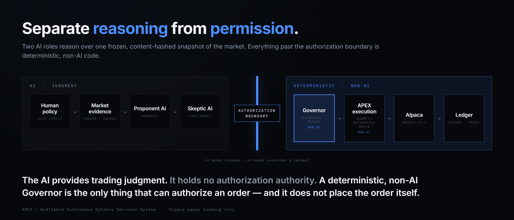
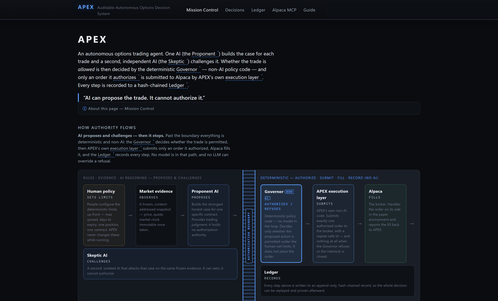
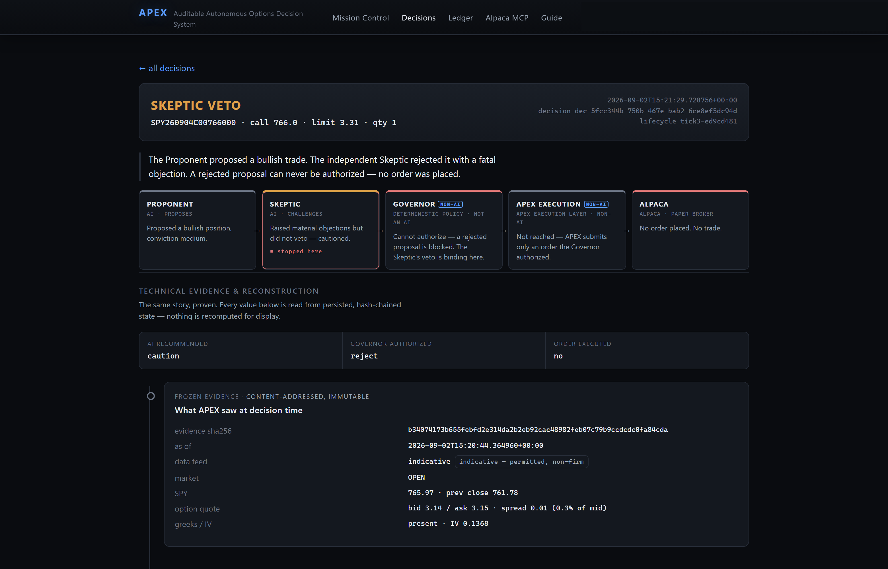
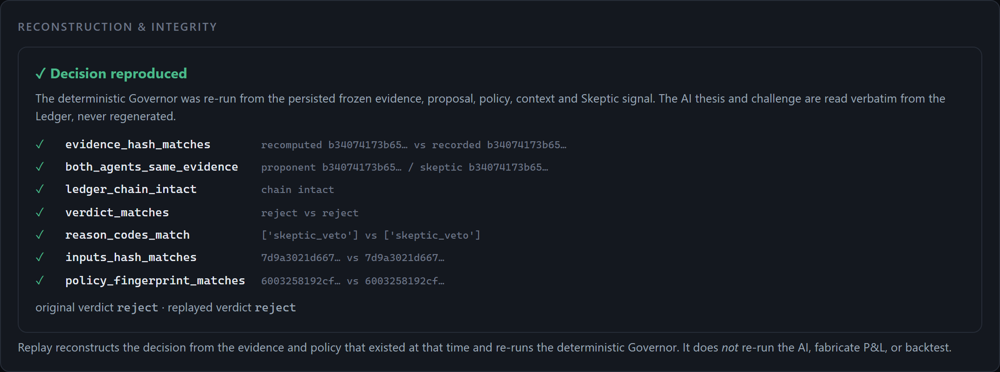
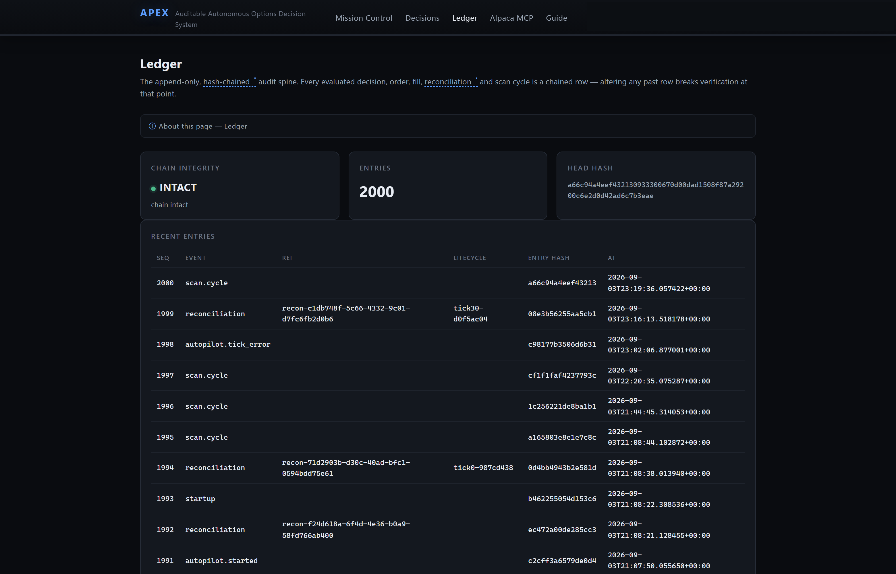

# APEX — a governed autonomous AI trading agent

**One AI proposes a trade. A second, independent AI tries to tear it apart. Then
non-AI code — not a model — decides whether the trade is allowed, and every step
is written to a tamper-evident record you can replay.**

> *"AI can propose the trade. It cannot authorize it."*

APEX (Auditable Autonomous Options Decision System) is an autonomous options
**paper-trading** agent built for the Alpaca AI Trading Agents Hackathon. This
repository is a **case study** — a write-up and sanitized screenshots. The
implementation source is private.

---

## Why it exists

Hand an LLM a brokerage connection and tell it to "trade options autonomously,"
and you get a system whose judgement you cannot inspect, cannot challenge, and
cannot reconstruct after the fact. When it loses money, you can't tell whether
the reasoning was sound and the market moved, or the reasoning was never sound.
P&L alone doesn't tell you whether the decision process deserved confidence.

APEX is an answer to a narrower, more general question than "can an AI trade?":

**How does an AI take part in a consequential decision without being the thing
that authorizes it?**

---

## Architecture



```
Human policy → Market evidence → Proponent AI → Skeptic AI
                                                  ┊  authorization boundary  ┊
        Governor (deterministic, non-AI) → APEX execution layer → Alpaca → Ledger
```

| Stage | Role | AI? |
|---|---|---|
| **Human policy** | Deterministic limits set in advance — max spread, days to expiry, one position, exactly one contract. | no |
| **Market evidence** | A single frozen, content-hashed snapshot (price, quote, greeks/IV, market clock). Immutable once taken. | no |
| **Proponent** | Argues *for* one specific single-leg contract: a structured thesis, cited evidence, acknowledged risks. | **yes** |
| **Skeptic** | A *separate context* over the *identical* snapshot. Argues *against*; each objection carries a checkable data path, an if-true-then consequence, and a severity. Both roles echo the same `evidence_sha256` — a mismatch fails the decision closed. | **yes** |
| **Challenge assessor** | Checks the Skeptic actually engaged (objection paths resolve, no vagueness, concrete consequences). A schema-invalid or non-genuine Skeptic is never silently treated as "no objection." | no — rule-based |
| **Governor** | A pure function: `(snapshot, proposal, policy, context, skeptic) → verdict + reason codes`. No model, no randomness. The **sole authorization boundary** — it decides only *whether the action is permitted*, and it never places an order. | **no** |
| **APEX execution layer** | A separate non-AI component. Submits *exactly one* order for an authorized decision with a deterministic `client_order_id`; submits *nothing* when the Governor refuses. Holds no decision logic. | **no** |
| **Alpaca** | Paper broker. Fills the order and reports back. | no |
| **Ledger** | Append-only, hash-chained record. Every evaluated decision — executed and refused alike — is a row that chains to the prior hash. | no |

**The key design principle:** the AI provides trading *judgment*; it holds no
*authorization authority*. It can never authorize execution or override a
deterministic rejection.

---

## What makes it safe to run unattended

| Guarantee | How |
|---|---|
| **AI can't authorize** | Only the deterministic Governor produces an AUTHORIZE verdict. No model is on that path. |
| **Independent challenge** | The Skeptic runs in its own context over the same hash-verified evidence. Its veto is binding on the Governor. |
| **Fail-closed** | Any unusable-AI path (bad schema, evidence-hash mismatch, spend ceiling hit) → a recorded REJECTED decision and **no order**. |
| **Positive interlock** | A master switch (default **off**) plus a start-time gate that even a Governor-approved entry can't cross until explicitly enabled — and that never blocks exits. |
| **Account pinning** | Startup fails closed if the connected account number isn't the expected one. |
| **Deterministic exits** | Position-exit logic runs *before any AI* on every cycle. |
| **Reconciliation-first** | On every restart the broker is treated as the source of truth; unexplained drift halts new entries. |
| **Idempotent orders** | Deterministic `client_order_id` + an anti-resubmission cooldown on materially identical rejected candidates. |
| **Bounded** | Paper-only, hard-locked. Exactly one contract per position. A configurable daily AI-spend ceiling. |
| **Reconstructable** | Genuine replay rebuilds any past decision from its frozen evidence and re-runs the deterministic Governor — reproducing the verdict, reason codes, inputs hash and policy fingerprint. It does **not** re-run the model, fabricate P&L, or backtest. |
| **Independent read-only cross-check** | The official Alpaca MCP server is integrated as a genuine, read-only verification channel (4-tool allowlist; write-verb tools refused locally). It confirms account identity — it is deliberately **not** on the trade path. |

---

## Screenshots — the real judge-facing UI

All captured from the deployed read-only dashboard. The paper-account identifier
is masked; no keys, secrets, `.env` or account balances appear.

### The whole idea, above the fold


### A real decision where the Skeptic stopped the trade


The Proponent proposed a bullish position. The independent Skeptic raised a fatal
objection on the same frozen evidence. A rejected proposal can never be
authorized — **APEX EXECUTION was never reached; no order was placed.** The
refusal is recorded in the same hash-chained Ledger, in the same shape, as an
executed trade.

### That decision, recomputed — not just recalled


### The append-only, hash-chained Ledger


---

## What I owned vs. what was AI-assisted

**I (Rudolph Miller) owned the product and the system decisions.** The problem
framing ("AI takes part in a consequential decision without authorizing it"), the
separation-of-powers architecture, the rule that a deterministic non-AI Governor
is the *only* authorization boundary, the fail-closed-everywhere stance, the
"refusal is first-class evidence" principle, the hash-chained-Ledger + genuine-
replay requirement, the paper-only / one-contract / interlock-default-off
constraints, the checkpoint-by-checkpoint acceptance gates, and the testing
expectations (full regression + real-broker validation before any checkpoint
passed) — all mine.

**Implementation was AI-assisted.** **Claude Code** wrote much of the
implementation under that direction, checkpoint by checkpoint. **ChatGPT** acted
as an executive architecture, strategy, and adversarial reviewer — every
checkpoint report went through it before it closed. The commit history reflects
this. I am not claiming I hand-typed the whole system; I am claiming I directed
it, reviewed it, and decided when each piece was acceptable.

---

## Honest status

- **Fully built and validated through a documented checkpoint sequence (0–9):**
  technical spike → foundation → trading core → AI reasoning → autonomous
  lifecycle → judge UI → MCP integration → deployment → hardening → submission
  readiness. Each gate had explicit pass criteria and a full regression run
  (260+ unit/HTTP tests, browser E2E, type + lint clean).
- **Alpaca paper trading only.** Never real money. The account is a paper
  account; position size is hard-locked to one contract.
- **It was never submitted to the hackathon.** The team chose not to submit. The
  system reached submission-ready state; the final submission action did not
  happen.
- **No claim of profitability, production-readiness, or regulatory compliance.**
  APEX demonstrates that a consequential AI-assisted trade can be *governed*,
  *challenged*, *reconstructed*, and *evaluated against what the system actually
  knew at the time*. It does not demonstrate a profitable strategy, and nothing
  here should be read as evidence of one.
- The deployed dashboard is a **read-only** surface (an HTTP layer 405s every
  non-GET; CSP `form-action 'none'`). Nothing on it can place an order, move
  policy, or write the Ledger.

---

## Interview talking points

- **Separation of powers for AI systems.** The transferable idea isn't options
  trading — it's that an AI can contribute judgment to a high-stakes decision
  while a deterministic, inspectable boundary holds the actual authority. Same
  pattern applies to spend approvals, content publishing, infra changes,
  clinical decision support.
- **A refusal is a first-class artifact.** Most systems log successes and treat
  rejections as errors. APEX records "what it chose *not* to do, and why" in the
  same audited shape as an action — that's what makes the decision process
  auditable rather than just the outcomes.
- **Adversarial review over consensus.** Two models that agree tell you little.
  One model building the strongest case and a *separate* model attacking it on
  identical, hash-verified evidence — with a non-AI check that the attack was
  genuine — surfaces failure modes a single pass hides.
- **Deterministic replay vs. "trust the logs."** Re-running the actual
  authorization function from frozen inputs and getting a bit-identical verdict
  is a much stronger claim than a log line. It also draws a hard line: replay
  reconstructs the *decision*, it never re-runs the model or fabricates P&L.
- **Fail-closed as a default, not a feature.** Every ambiguous state —
  unparseable time gate, malformed model output, evidence-hash mismatch,
  unexplained broker drift — resolves to "do nothing and record why."
- **Honest evaluation.** The project's own framing: *we don't only measure
  whether it made money; we measure whether its reasoning deserved to be
  trusted.*

---

## License

See [`LICENSE`](LICENSE). This case study is published for portfolio review. The
APEX implementation is a private, proprietary project.
